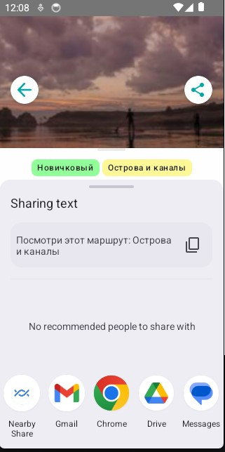

# Отчет о баге: Не работает кнопка «Поделиться» на экране деталей слота

## 🎯 Симптом и цель
**Симптом:** На экране деталей слота (`SlotDetailsScreen`) отображается кнопка «Поделиться» (иконка `Icons.Share`), но при нажатии на нее ничего не происходит. Системное меню выбора приложения для отправки данных не открывается. 
**Причина:** В коде UI-компонента `SlotDetailsContent` в обработчик клика кнопки передана пустая лямбда: `onClick = {}`.

**Цель:** Реализовать рабочий функционал кнопки «Поделиться», чтобы при нажатии открывалось стандартное Android-меню (Share Sheet) для отправки текста/ссылки с информацией о маршруте.

## 📋 Требования
1. **Функциональные:** При нажатии на кнопку должен формироваться и запускаться `Intent` с действием `Intent.ACTION_SEND` и типом `text/plain`. В `Intent` должен передаваться осмысленный текст (например, название маршрута из `slot.route.name`).
2. **Архитектурные (опционально/на усмотрение команды):** 
   * В приложении используется паттерн MVI (судя по передаче событий через `onIntent(SlotDetailsIntent...)`). 
   * *Идеальное требование:* Добавить новое событие `SlotDetailsIntent.Share`, обработать его в `ViewModel` и вызвать `Intent` оттуда (или через SideEffect).
   * *Допустимое (быстрое) требование:* Если для системных UI-событий сделано исключение, допустимо получить `Context` через `LocalContext.current` прямо внутри `@Composable` функции и вызвать `startActivity` на месте.

## 💬 История промптов (диалог)

**Промпт 1:**
> (Uploaded [file](SlotDetailsScreen.kt)) В андроид приложении не работает кнопка поделиться, она отображается, но при нажатии ничего не происходит, предполагаю, что баг находится здесь

**Промпт 2:**
> Используя наш с тобой диалог составь этого бага .md документ и кратко:
> описать симптом или цель;
> найти требования (если есть);
> прикрепить все отправленные промпты;

## Результат
