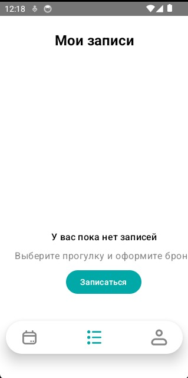
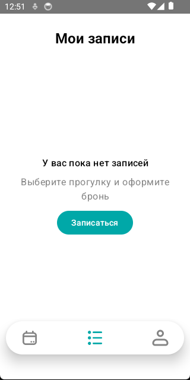

# Баг: Нецентральное отображение состояния пустого списка записей

## Симптом / Цель
На экране «Мои записи» в состоянии пустого списка (`Loadable.Empty`) и ошибки (`Loadable.Error`) надпись и кнопка действия отображаются не по центру экрана, а смещены вниз. 

**Цель:** расположить компонент `BookingStateMessage` по центру экрана (с учётом заголовка сверху).

## Причина
1. В `BookingListScreen` компонент `BookingStateMessage` вызывался напрямую внутри корневого `Box` без обёртки с выравниванием, из-за чего он рендерился в позиции по умолчанию (`TopStart`).
2. Сам `BookingStateMessage` использует `Modifier.offset(x = ..., y = VolnaTheme.tokens.sizing.listStateMessageY)`, который дополнительно смещает контент по вертикали, усиливая визуальное «прижатие» к низу.

## Требования
- В состояниях `Empty` и `Error` текст и кнопка должны быть отцентрированы по горизонтали и вертикали относительно доступной области экрана.
- Заголовок «Мои записи» должен оставаться в верхней части экрана.
- Горизонтальные отступы компонента должны сохраняться (через `padding`, а не `offset`).

## Решение
1. В `BookingListScreen` для веток `Loadable.Empty` и `Loadable.Error` обернуть `BookingStateMessage` в `Box` с модификаторами:
   ```kotlin
   Box(
       modifier = Modifier.fillMaxSize(),
       contentAlignment = Alignment.Center
   ) {
       BookingStateMessage(...)
   }
   ```
2. В `BookingStateMessage` заменить `offset` на `padding`:
   ```kotlin
   modifier = Modifier
       .width(VolnaTheme.tokens.sizing.contentWidth)
       .padding(horizontal = VolnaTheme.tokens.spacing.md)
   ```

## Отправленные промпты
1. *«Необходимо исправить баг в андроид приложении, надпись и кнопка располагаются не по центру»*
2. *«Теперь надпись и кнопка не отображаются совсем, попробуй использовать другой способ»*
3. *«Ничего из этого не помогло, нужен другой способ»*
4. *«Снова мимо, давай попробуем отобразить просто текст вместо BookingStateMessage»*
5. *«Помогло, вот код BookingStateMessage, давай сделаем по нормальному»* + код компонента `BookingStateMessage`

## Результат(до и после)

