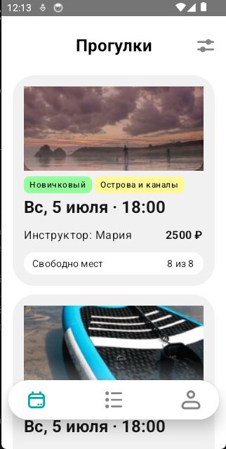
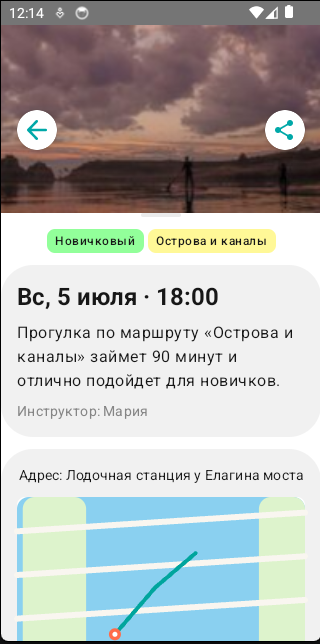

# Отчёт о добавлении фичи: Отображение изображений на экране SlotDetailsScreen и SlotListScreen

## 📋 Описание симптома/цели

**Симптом:** На экране Android-приложения, на вкладке "Прогулки" не отображаются изображения маршрутов. Вместо реальных картинок показывались цветные градиенты.

**Цель:** Настроить отображение локальных изображений (`image_1.jpg`, `image_2.jpg`) в компоненте `SlotDetailsHero()` и `SlotPreviewPhoto()` на экране деталей прогулки.

## 📌 Требования

### Технические требования:
1. **Библиотека для загрузки изображений:** Coil
   ```kotlin
   implementation("io.coil-kt:coil-compose:2.6.0")
   ```

2. **Размещение файлов:** Изображения должны находиться в папке:
   ```
   client/androidApp/src/main/assets/
   ├── image_1.jpg
   └── image_2.jpg
   ```

3. **Путь к изображениям:** Использовать схему `file:///android_asset/`

4. **Компоненты Coil:** 
   - `coil.compose.AsyncImage`

### Структурные требования:
- Изображения НЕ должны быть в `shared/src/commonMain/assets/` (это не работает для Android)
- Изображения НЕ должны быть в `res/drawable/` (проблемы с доступом из shared модуля в KMP)
- Правильное место: `androidApp/src/main/assets/`

## 💬 История промптов

### Промпт 1: Первичное описание проблемы
```
На экране андроид приложения, на вкладке прогулки не отображаются изображения необходимо найти место где в проекте находится этот баг, предполагаю, что он находится здесь
```

### Промпт 2: Уточнение задачи
```
Исправь только первый баг
```

### Промпт 3: Вопрос о локальных изображениях
```
У меня изображения хранятся в папке в корне проекта как мне их туда передать
```

### Промпт 4: Предоставление структуры проекта
```
Вот тебе для понимания структура проекта, я туда ли добавил image_1 и image_2? Просто тут ошибка вылазит
```

### Промпт 5: Запрос на упрощение решения
```
Мне нужно чтобы у меня заработало, остальное не сильно волнует
```

### Промпт 6: Сообщение о сохранении ошибки
```
У меня всё ровно так и было
```

### Промпт 7: Вопрос о проверке пакета
```
Импортируйте правильный R класс - из вашего androidApp модуля (обычно com.volna.app.androidapp.R или посмотрите какой пакет у вашей MainActivity) как это проверить
```

### Промпт 8: Смена подхода
```
Нет, пробуем другой способ загрузки изображения
```

### Промпт 9: Финальная проблема с путём
```
приложение скомпелировалось и запустилось, но картинки не отображаются, я думаю ты ошибся с путём к картинке
```

## ✅ Итоговое решение

### Изменения в `SlotDetailsScreen.kt` и `SlotListScreen.kt`:
()`:

1. **Добавить импорты:**
```kotlin
import coil.compose.AsyncImage
import androidx.compose.ui.layout.ContentScale
```

2. **Заменить функцию `SlotDetailsHero()`:**
```kotlin
@Composable
private fun SlotDetailsHero(imagePath: String) {
    Box(
        modifier = Modifier
            .fillMaxWidth()
            .height(188.dp)
    ) {
        androidx.compose.foundation.Image(
            painter = coil.compose.rememberAsyncImagePainter(
                model = imagePath // путь к файлу в assets
            ),
            contentDescription = "Обложка маршрута",
            modifier = Modifier.fillMaxSize(),
            contentScale = androidx.compose.ui.layout.ContentScale.Crop
        )
        
        Box(
            modifier = Modifier
                .fillMaxWidth()
                .height(96.dp)
                .align(androidx.compose.ui.Alignment.BottomCenter)
                .background(
                    brush = Brush.verticalGradient(
                        colors = listOf(Color.Transparent, Color.Black.copy(alpha = 0.20f)),
                    ),
                ),
        )
    }
}
```
3. **Заменить функцию `SlotPreviewPhoto()`:**
```kotlin
@Composable
private fun SlotPreviewPhoto(imagePath: String) {
    Box(
        modifier = Modifier
            .fillMaxWidth()
            .height(120.dp)
    ) {
        androidx.compose.foundation.Image(
            painter = coil.compose.rememberAsyncImagePainter(
                model = imagePath // путь к файлу в assets
            ),
            contentDescription = "Обложка маршрута",
            modifier = Modifier.fillMaxSize(),
            contentScale = androidx.compose.ui.layout.ContentScale.Crop
        )

        Box(
            modifier = Modifier
                .fillMaxWidth()
                .height(44.dp)
                .align(androidx.compose.ui.Alignment.BottomCenter)
                .background(
                    brush = Brush.verticalGradient(
                        colors = listOf(Color.Transparent, Color.White.copy(alpha = 0.36f)),
                    ),
                    shape = RoundedCornerShape(VolnaTheme.tokens.radius.lg),
                ),
        )
    }
}
```

4. **Добавить зависимость в `client/shared/build.gradle.kts`:**
```kotlin
dependencies {
    implementation("io.coil-kt:coil-compose:2.6.0")
}
```

### Структура проекта после исправлений:
```
client/
├── androidApp/
│   └── src/main/
│       ├── assets/
│       │   ├── image_1.jpg
│       │   └── image_2.jpg
│       └── java/com/volna/app/android/
│           └── MainActivity.kt
└── shared/
    └── src/commonMain/kotlin/com/volna/app/catalog/presentation/
        ├── SlotDetailsScreen.kt
        └── SlotListScreen.kt
```
## Результат



## 🔑 Ключевые выводы
1. В KMP для Android специфичных ресурсов используйте `androidApp/src/main/assets/`
2. Coil упрощает загрузку изображений по сравнению с expect/actual
3. Путь к assets в Android: `file:///android_asset/имя_файла`
4. Не пытайтесь использовать ресурсы из `shared` модуля для Android-специфичных файлов
