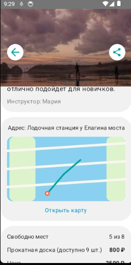
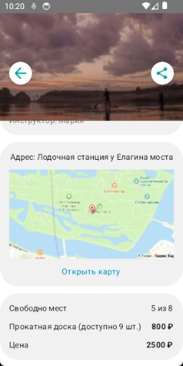

# Замена Canvas-заглушки на Yandex Static Maps API

## 📋 Описание

### Симптом / Цель
В Android-приложении в экране деталей слота (`SlotDetailsScreen.kt`) карта отображалась как абстрактная заглушка, нарисованная через `Canvas` с геометрическими фигурами. 

**Необходимо:** Заменить заглушку на реальное изображение карты с использованием координат точки встречи (`meetingPoint`), которые уже приходят в модели `Slot`.

### Требования
- ✅ **Бесплатное решение** — без дополнительных затрат
- ✅ **Статическая карта** — не обязательно интерактивная
- ✅ **Отображение метки** — точка встречи должна быть отмечена на карте

---

## 🛠 Реализация

### Выбранное решение
**Yandex Static Maps API** — бесплатный сервис для генерации статических карт по координатам.

### Изменения в коде

#### 1. **Настройка Gradle** (`androidApp/build.gradle.kts`)
```kotlin
android {
    defaultConfig {
        buildConfigField("String", "YANDEX_MAPS_API_KEY", 
            "\"${project.findProperty("yandexMapsApiKey") ?: ""}\"")
    }
    
    buildFeatures {
        buildConfig = true
    }
}
```

#### 2. **Конфигурация** (`local.properties`)
```properties
yandexMapsApiKey=ваш_api_ключ
```

#### 3. **Обновлённый код** (`SlotDetailsScreen.kt`)

**Заменили функцию `SlotDetailsMapPreview()`:**

```kotlin
@Composable
private fun SlotDetailsMapPreview(slot: Slot) {
    val lat = slot.meetingPoint.latitude
    val lng = slot.meetingPoint.longitude
    
    val apiKey = BuildConfig.YANDEX_MAPS_API_KEY
    val imageUrl = "https://static-maps.yandex.ru/1.x/?" +
        "ll=$lng,$lat&" +
        "z=15&" +
        "l=map&" +
        "pt=$lng,$lat,pm2rdm&" +
        "size=600,300&" +
        "apikey=$apiKey"

    androidx.compose.foundation.Image(
        painter = coil.compose.rememberAsyncImagePainter(model = imageUrl),
        contentDescription = "Карта маршрута",
        modifier = Modifier
            .fillMaxWidth()
            .height(156.dp)
            .background(
                color = Color.White,
                shape = RoundedCornerShape(VolnaTheme.tokens.radius.sm)
            ),
        contentScale = ContentScale.Crop,
    )
}
```

**Обновили вызов в `SlotDetailsMapCard()`:**
```kotlin
SlotDetailsMapPreview(slot = slot) // передаём slot с координатами
```

---

## 📤 Отправленные промпты

### Промпт 1
> На сколько я знаю сейчас карта в этом андроид приложении генерируется из геометрических фигур, есть координаты точки встречи, необходимо как-то это исправить чтобы отображалось изображение самой карты, не обязательно интерактивное(можно обычное фото)

### Промпт 2
> Затронет ли какой-то из этих способов бэкэнд

### Промпт 3
> Давай 2 вариант, только через бесплатный способ и отправь мне сразу ссылку на получение api ключа

### Промпт 4
> Я сделал ключ в yandex static api, давай теперь работать с этим

### Промпт 5
> [Ошибка компиляции: Unresolved reference 'BuildConfig', 'LocalImageLoader', 'clip']

---

## 🔧 Параметры карты

**URL параметры Yandex Static Maps:**
- `ll` — центр карты (долгота, широта)
- `z` — zoom (15)
- `l` — тип карты (`map` = схема)
- `pt` — метка (координаты + стиль `pm2rdm` = красный пин)
- `size` — размер изображения (600x300)
- `apikey` — API ключ

**Альтернативные стили меток:**
- `pm2rdm` — красный
- `pm2blm` — синий
- `pm2grm` — зелёный
- `pm2ylm` — жёлтый

---

## ✅ Результат

- ✅ Карта отображается реального вида
- ✅ Точка встречи отмечена красным пином
- ✅ Бесплатный тариф

---

## 📝 Примечания

**Важно:** 
- Файл `local.properties` должен быть добавлен в `.gitignore`
- API ключ хранится в `BuildConfig` и не попадает в репозиторий
- Coil уже был в проекте, поэтому загрузка изображений работает "из коробки"

## Результат(До/После)

